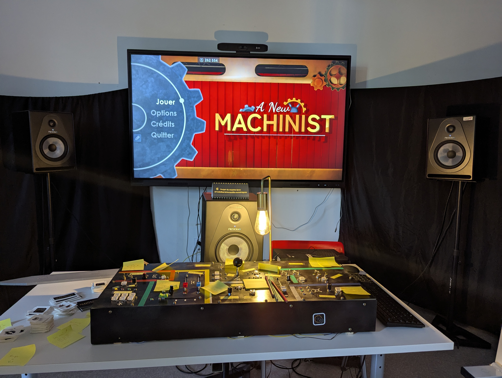
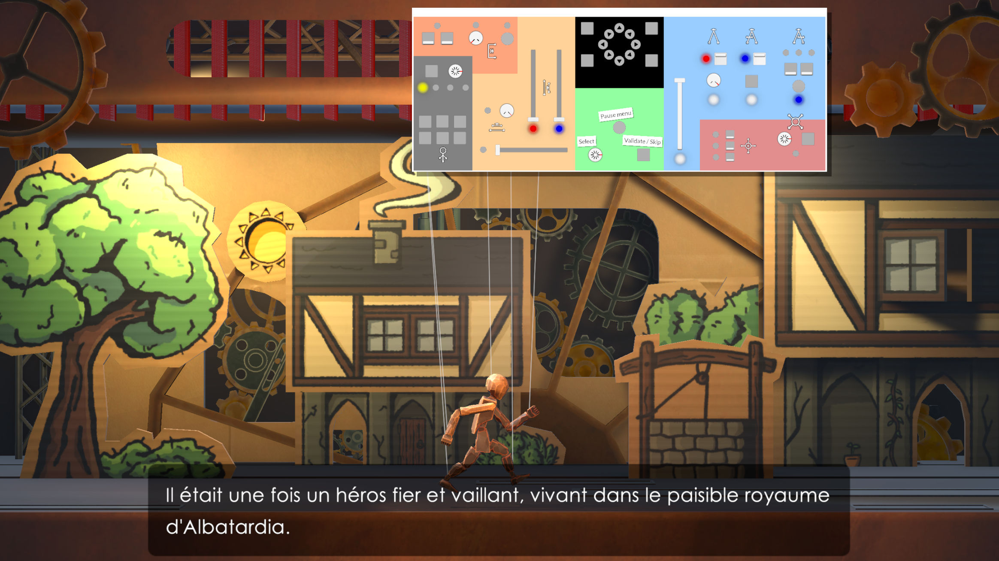
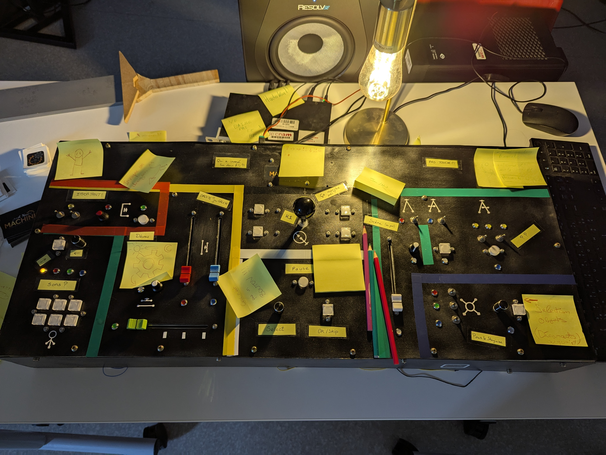

## Presentation

A New Machinist is a game we created as a **team of eight** plus the help of two as part of our **final project** for our first year of master's degree.

In this game, you play the role of a puppeteer candidate at a puppet theatre. Learn how to use your console to control the stage and follow the director's instructions or improvise based on the elements you give him.

The original experience is played with a **physical console** that we built. It features no less than 17 buttons, 9 switches, 3 rotary encoders, 3 potentiometers, 4 faders (one of which is motorised) and 22 LED indicators!

## Technical overview

For this project, I was in charge of :

- Crafting the console and interfacing it with Unity
- Programming the UI and some of the gameplay elements
- Helping to implement the dialogue and act integration tool

### Languages used

This project was created using **Unity** and therefore used **C#** as well as **C++** and **C** for the Arduino code.

### The console

One of the main challenge in this project was to craft from scratch a working console and to connect it with Unity as I had very little experience with elecronics and never had to use that many components.

The whole circuit is built arround an [**Arduino Due board**](https://docs.arduino.cc/hardware/due/) that has 66 pins for us to use, a lot more than the average Arduino. Still, it wasn't quite enough for all the components we wanted to control so I had to make a clever usage of **multiplexers** to be able to connect even more components.

I had also did not anticipate that **power would become an issue** (for the LEDs especially) as my previous projects were a lot smaller and the board could easily power all the components on its own. 
For this project, the board does not power any LED but instead controls **transisors** that let the current of an **external power source** flow. 

The finished console works quite well thanks to the time I put into it, but I hope I never have to fix the mess underneath.

## The team

- **Tanguy BRUSCHI** - Sound Designer & Composer
- **Edouard CHAANG** - Additional Programming
- **Justine DESMEDT** - Game Designer, Narrative Designer & Writer
- **Matthieu GOLSENNE** - Game Designer, Narrative Designer, Additional Writing & Additional Programming
- **Tom JAMGOTCHIAN** - Voice Actor
- **Paul LUNEAU** - Programmer
- **Gensana MANCEAU** - Producer & Additional Writing
- **Daphné RENAULD** - Texture Artist
- **Gabin ROHDE** - Game Artist
- **Natanael ROSSIGNOL** - Game Artist

## Trailer



## Links


 Itch.io









 GitHub Repository




