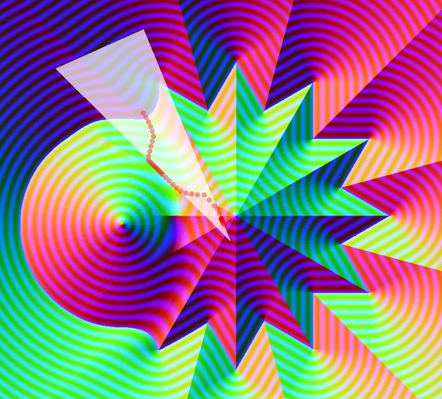

## Project description

SDF Physics is the support I developped to illustrate a dissertation I made about Signed Distance Fields (SDFs) and the ways we can detect overlaps between SDFs and points, SDFs and triangles and SDFs and other SDFs.

## Technical overview

### Languages and tools used

For this project, I used the C++ library SMFL as well as ImGui as a simple UI and CMake.

### What I learned

Thanks to this project I got to learn :

- A lot more about SDFs and their many applications
- How to read and write research articles
- How to implement a simple **Verlet physics solver**

## Links


 Download the dissertation (in French)
  


 GitHub Repository
  


